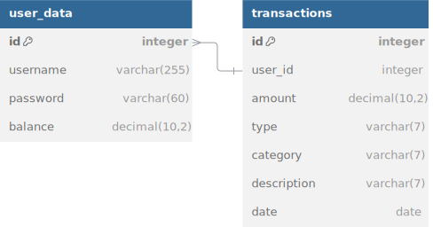
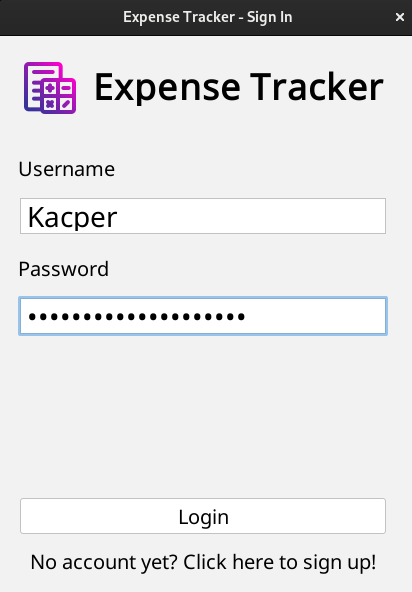
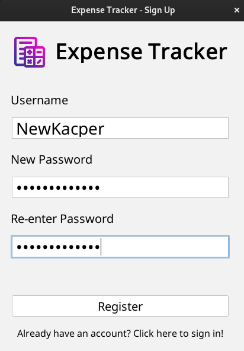
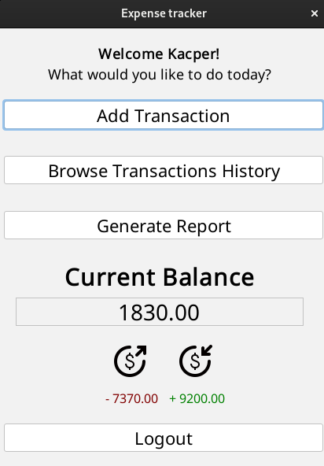
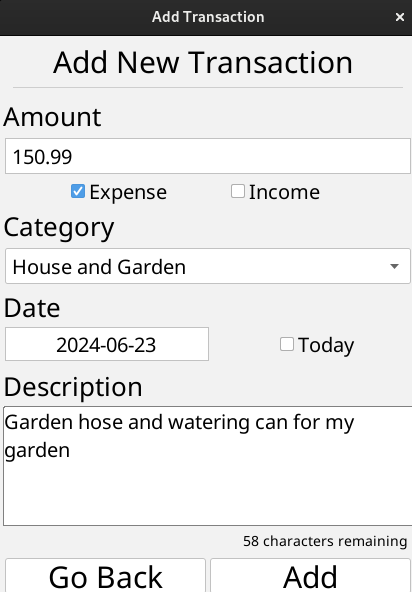
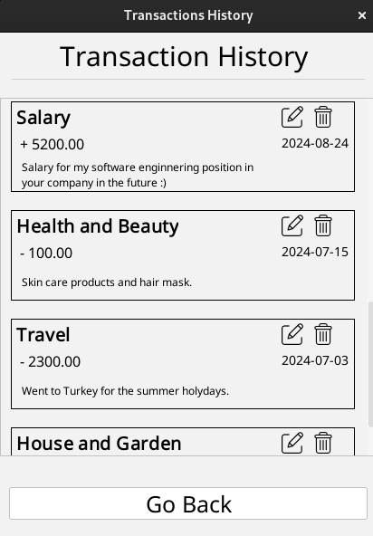
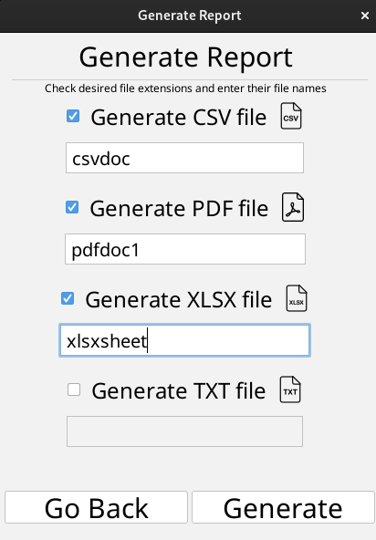

# 💸 Expense Tracker App

## 📜 Description

A Java desktop application designed for managing and tracking expenses and income. The application uses Swing for the user interface, MySQL for database management, Jbcrypt for password encryption, iText for PDF generation, and Apache POI for creating Excel files.

## 📝 Notes

- Ensure you have Java 8 or later installed on your system. 🌟
- The `javac` and `java` commands require a properly configured Java Development Kit (JDK). 🛠️
- If you encounter any issues with missing dependencies, make sure all required libraries are included in the `lib` directory. 🔍

## 🛠️ Usage

1. **Login or Create an Account**: Enter your username and password, or register a new account if you don’t have one yet. 🔐
2. **Access the Main Frame of the Application**: The app displays:
   - **Your Name**: The currently logged-in user's name and a welcoming label. 👋
   - **Buttons**: Various buttons for managing transactions. 🔲
   - **Current Balance**: Your total balance. 💵
   - **Money Flow**: Aggregated amounts for expenses and income. 📈📉
   - **Logout Button**: To switch accounts. 🔄

3. **Transaction Management**: 
   - **Add Transaction**: Add a new transaction to the database. You can enter:
     - **Amount**: The amount of money to deposit or withdraw. 💰
     - **Type**: Checkbox to specify if the transaction is an expense or income. 💸💵
     - **Category**: Combo box for selecting the transaction category, updated based on the type selected. 🏷️
     - **Date**: The transaction date, with an option to use today’s date. 📅
     - **Description**: An optional description for the transaction. ✍️
   - **Browse Transaction History**: View your transaction history through organized cards. You can:
     - **Edit Card**: Modify any attributes of the transaction. 📝
     - **Delete Card**: Remove the transaction from history and database. 🗑️
   - **Generate Report**: Create and save a report in one of the following formats:
     - Save in **CSV**, **PDF**, **XLSX**, or **TXT** formats. 📊🗂️

## 📁 Project Structure

- `src/` - Source code directory
  - `com/`
    - `expenseTracker/` - Java source files
      - `backend/` - Database connectors, data storers and data flow utils
      - `frontend/` - GUI frames, panels and other components, graphical utils
      - `main/` - Main method
      - `test/` - Unit tests and test resources
  - `resources/assets/images` - Image and icon assets
- `lib/` - External libraries including:
  - **MySQL** - For database management. 🗄️
  - **Jbcrypt** - For password encryption. 🔐
  - **iText** - For PDF generation. 📄
  - **Apache POI** - For Excel file creation. 📈

## 📙 Database Schema

  

## 🖼️ Screenshots

  
  
  
  
  
  

